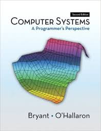

= COS 284--Introduction to Computer Systems
Tom Nurkkala <tnurkkala@cse.taylor.edu>
v1.0, January 2016

== Introduction

With your host, Dr. {firstname} Nurkkala

== Sidebar Thing

Here's a sidebar!

.A Sidebar
****
This is a sidebar.

[discrete]
== (Discrete) Header

. What about
. Numbered lists
. Or Images
****

== The Textbook Section

[sed,file="foo.html"]
.Read the Textbook
--
[discrete]
== Why?

Because you'll learn a lot more.

[discrete]
== How?

Here's how

. Open your eyes.
. Scan the pages.
. Do the practice problems.
--

[sed]
--
In a *bitter* twist of fate,
the previous edition (the 2^nd^) of our text,
illustrated here:

Has been *replaced*
by a new edition (obviously, the 3^rd^),
which has a fancier cover:

image::course/cos284/images/csapp3e-cover.jpg[CSAPP 3 Cover,200]
--

It's really quite a delightful text.
- You should all read it carefully.

[sidebar]
.Factoids
--
Here are some interesting factoids about the course

[discrete]
=== A List

. It's fun
. You will have a great time
. There will be a ton of work to do
--

== Stunning Conclusions

NOTE: This is really cool.

.Title for a Little Code
[[this-is-me]]
[source,javascript,role="visual"]
----
gulp.task('markdown', function() {
    return gulp.src(course)
        .pipe(markdown())
        .pipe(gulp.dest('build'))
});
----
